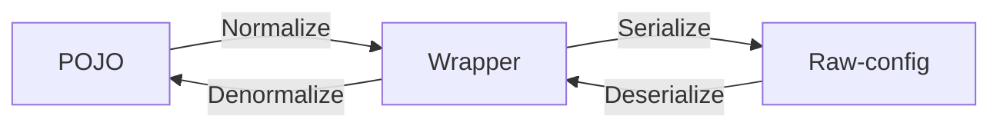
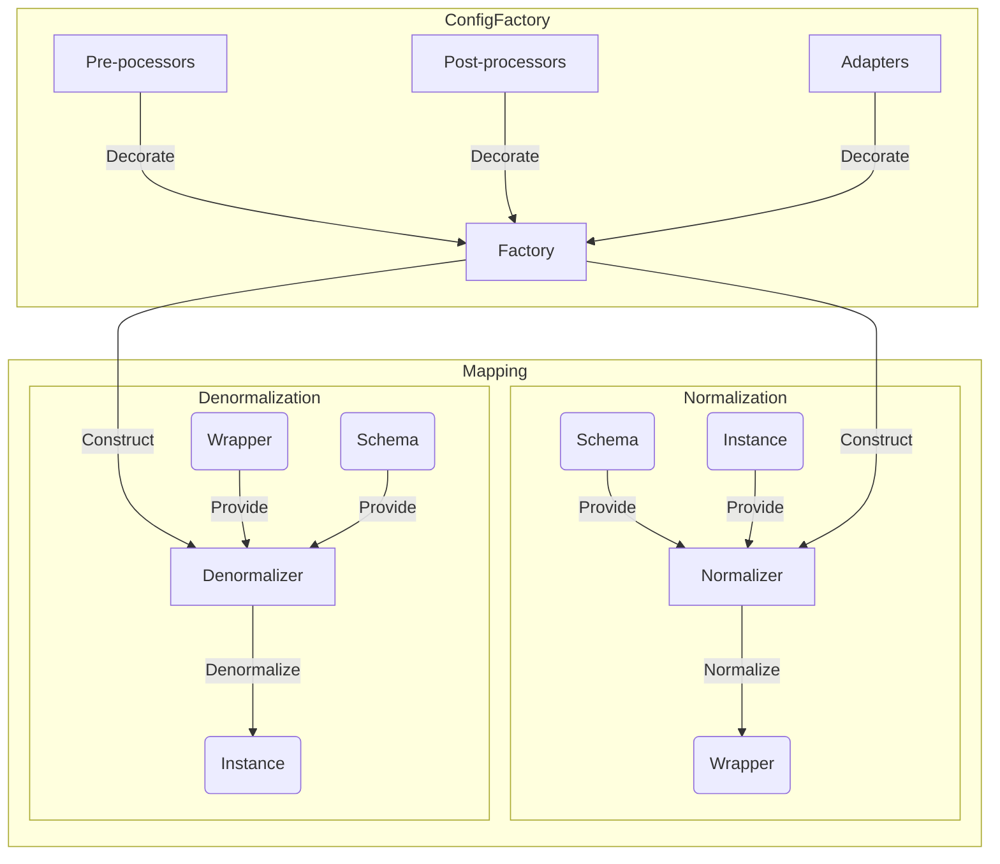
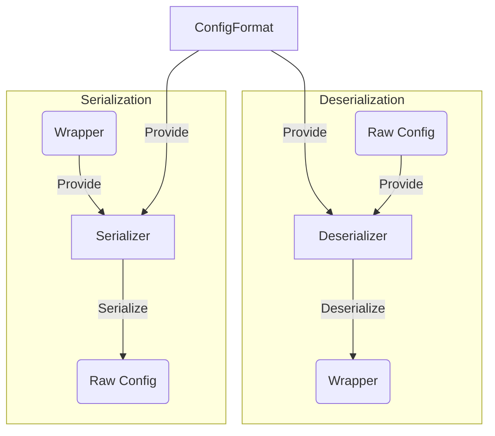
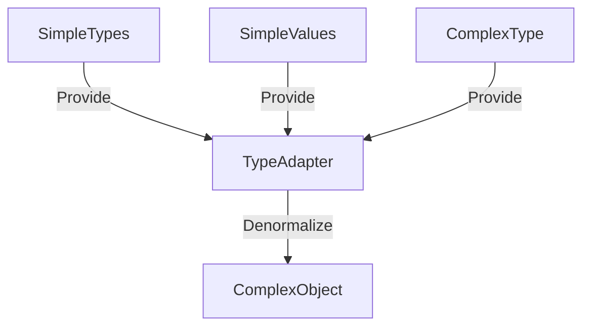
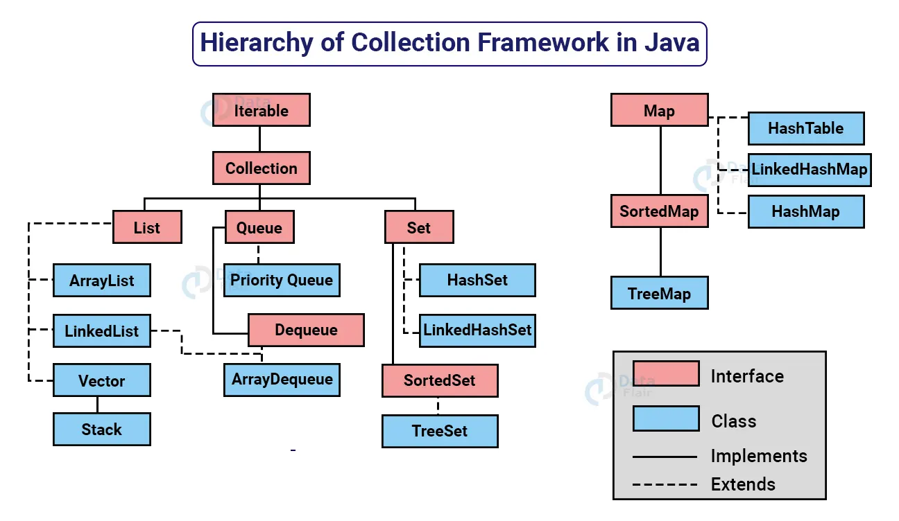
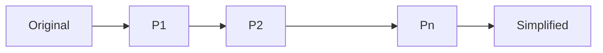

# Internal

## Introduction
- Following example codes are pseudo. Actual implementation maybe slightly different.
- See wiki: https://github.com/anhcraft/config/wiki

## Goals
- Lightweight and simple
- Loosely-couped modularity and extendability

# Architecture

## Modules
- `core`: contains the framework, built-in type adapters, built-in processor and common utilities
- `bukkit`: target the Bukkit platform (Minecraft server-side)
  - depends `core`
  - contains platform-dependent type adapters and processors
- `bungee`: target the Bungeecord platform (Minecraft proxy-side)
  - depends `core`
  - contains platform-dependent type adapters and processors
- `configdoc`: configuration documentation generator






- Demo code:
```java
public static void main(String[] args) {
    ConfigFactory factory = ConfigFactory.builder()
            .useBuiltInComponents(true)
            .registerAdapter(MyModel.class, MyModelAdapter.class)
            .build();

    Container container = factory.getNormalizer().normalize(MyModel.class, new MyModelInstance());
    container.set("key", "value");
    
    YamlSerializer yaml = YamlSerializer.builder()
            .compact(false)
            .build();
    String output = yaml.serialize(container);
    container = yaml.deserialize(output);

    MyModel instance = factory.getDenormalizer().denormalize(MyModel.class, container);
}
```

# Structure

| Java           | Blueprint | Configuration |
|----------------|-----------|---------------|
| Class          | Schema    | Schema        |
| Instance, POJO | -         | Wrapper       |
| Field          | Property  | Setting       |
| Value          | -         | Value         |

## Schema
- The schema represents the structure of a class
- The schema contains none, one or many properties
- The schema is factory-dependent (see ConfigFactory below)

## Property
- A property represents a **non-transient instance** field
  - A **final**, non-transient, instance field is also a property
- The property may contain value restrictions
- The property can be any of Java data types
- By default, the property name is derived from the field name
  - Property name conversion is customizable (see Naming Strategy below)
- The property is factory-dependent (see ConfigFactory below)

### Property annotations
- Annotations is the main approach to provide property metadata
- `@Name`: set the property primary name and aliases
  - `value` to define a list of possible name.
  - A name is valid if it is non-blank and not conflicted with previous name/aliases. If conflict exists, the name is implicitly discarded.
  - The first valid name is primary and used for normalization. Valid aliases are fallback options used solely on denormalization.
  - If no valid name exists, the default naming strategy is used: By default, the property name is derived from the field name
- `@Alias`: set the property aliases
  - `value` to define a list of possible aliases
  - It is similar to defining aliases using `@Name` except that:
    - Using `@Name`, the first valid name is the primary, the remaining valid names are aliases
    - Using `@Alias` only specifies the aliases. If `@Alias` is present while `@Name` is not, the primary name is auto-generated
  - If `@Name` and `@Alias` are both defined, the order of alias definition is `@Name` first, followed by `@Alias`
- `@Exclude`: exclude the field / let it no longer be a property
  - A static field or transient field is also ignored
  - Use `@Exclude` to avoid conflict, since other serialization library (such as Gson) ignore transient fields
- `@Describe`: describe the property
- `@Optional`: the optional only works for reference data types (including primitive wrappers) during denormalization
  - When `@Optional` is absent, the field value is `null` when the corresponding setting is absent from the Wrapper
  - When it is present, the field value will be kept as it is when the corresponding setting is absent from the Wrapper
- `@Validate`: validate the setting value
  - The difference between using `@Validate` and a separate validation is that `@Validate` integrates well with the ConfigDoc
  - When validation fails, the setting is skipped (see also: `@Optional`)
  - When validation fails, throws exception unless `silent` is set
- `@Transient`: strictly avoid normalization
  - **Note:** A transient field is ignored from the schema. However, using `@Transisent` includes the field and only avoid normalization
- `@Constant`: strictly avoid denormalization
  - **Note:** A constant/final field is included in the schema and denormalizable by default. However, using `@Constant` explicitly avoid denormalization
- `@Payload`: specify the payload type - see: Generic resolution

### Validation
- Provides simple value validation
  + For example: `@Validate("not-null, not-empty")`
  + Multiple parameters are separated by comma
  + Space in-between is optional
  + Applies to **denormalization** only
- Not-null:
  - Enforces an object to be non-null
  - Syntax: `not-null`, `notNull`, `non-null`, `nonNull`
- Not-empty:
  - Enforces a string or a container to be non-empty
  - Syntax: `not-empty`, `notEmpty`, `non-empty`, `nonEmpty`
- Not-blank:
  - Enforces a string to be non-blank
  - Syntax: `not-blank`, `notBlank`, `non-blank`, `nonBlank`
- Range:
  - Validates a number (floating-point support)
  - Lower bound: `range=0`, `range=0|`
  - Upper bound: `range=|1.5`
  - Two-sided bound: `range=0|1.5`
- Size:
  - Validates the length of a string or the size of a container (non-negative)
  - Lower bound: `size=5`, `size=5|`
  - Upper bound: `size=|3`
  - Two-sided bound: `size=2|7`

### Naming Strategy
- When `@Name` is absent, the field name is also the property name. It is possible to change the styling, for example, enforce property name to be kebab-case.
- Field name is assumed to be **camelCase** (Java convention)
- Built-in: default, PascalCase, snake_case, kebab-case
- Naming style can be manually-defined when constructing ConfigFactory

## Wrapper
- The wrapper is the intermediate representation of configuration
- The wrapper is independent of the schema

### Wrapper Instance
- A wrapper instance is a mutable K-V container
- The wrapper includes none, one or many settings

### Setting
- The setting has no value restrictions
- The setting must have **simple data types**

# Data types
## Simple data types
- Simple data type is a terminology used within the Wrapper context
- Simple data types are the most basic data types that any configuration format should support
  - Scalar types: 
    - Number, boolean, character
    - String
  - Compound type:
    - Dynamic-typed, ordered array
    - Container of ordered K-V entries (K must be string)
- The term _simple_ is used to distinct from _primitive_ data types which does not include string. String is a reference type in Java, however, it is a scalar type (simple type) in terms of configuration.

## Complex data types
- Beyond the Wrapper context, a data type is said to be complex which includes:
  - Java primitives
  - Reference types such as primitive wrappers, String, Collection, etc

## Conversion
- The process of converting a complex data type into a simple data type is called normalization.
- The process of converting a simple data type into a complex data type is called denormalization.
- (De)normalization does not guarantee consistency. It is dependent on type-adapting and value processing.

# Factory
- The factory is the central instance containing built-in and custom-registered components.
- The factory name prefixes with the platform name, e.g: `BukkitConfigFactory` for the `Bukkit` module.
  - The core factory name does not have prefix
- The factory is immutable to enforce consistency and thread-safety

### Normalizer
- The normalizer is constructed from a factory
- The purpose of the normalizer is to map a complex type into a simple type, so it can be put into a wrapper

| Java data type        | Wrapper-compatible | Note                   |
|-----------------------|--------------------|------------------------|
| Primitive             | Scalar             | No conversion          |
| Wrapper of primitives | Scalar             | No conversion          |
| String                | Scalar             | No conversion          |
| Array of simple type  | Array              | No conversion          |
| Wrapper container     | Container          | No conversion          |
| Array of complex type | Array              | Built-in type-adapting |
| Iterable              | Array              | Built-in type-adapting |
| Map                   | Container          | Built-in type-adapting |
| `@Configurable`       | Container          | Built-in type-adapting |
| _other_               | Container          | Custom type-adapting   |

### Denormalizer
- The denormalizer is also constructed from a factory
- The purpose of the denormalizer is to map a simple Java data type into the target complex type
- The denormalization is much complexer than the normalization:
  - Relies on the given type which may be an interface (abstract class), not an implementation class
  - Have to correctly find out an implementation class and instantiate it
  - Dynamic value resolution due to end-user convenience: cast string to a scalar value and vice versa, wrap a scalar value in compound type, etc



## Type Adapters
- It is possible to register custom adapters or override existing adapter(s) including the built-in
- The adapter associates with a complex data type. It has several use cases:
  - Ability to normalize a POJO which cannot be done using `@Configurable`
  - Ability to normalize a `@Configurable` class (overriding)
  - Ability to normalize a third-party class belonging to a library
  - Override a built-in or preceded type adapter
- The adapter has two main method:
  - Normalize a POJO into a wrapper
  - Denormalize a wrapper into the POJO
- The adapter should be stateless

### Type inheritance
- For a custom adapter of type `T`, It can work with POJO of type `T` or type `T' extends T`
- Normalization: It must be able to normalize type `T` into a wrapper. As a result, any `T' extends T` can be upcasted to type `T` and be normalized with loss of information
- Denormalization: A wrapper can be normalized into type `S` which `S` is `T` or downcast to `T' extends T`. `S` is found using type resolution.

### Avoid information loss
- As the type adapter of type `T` can process any type `T' extends T`, information from subclass may be lost during normalization. To avoid, it is possible to define type adapter `T'` so that:
  - Type adapter `T'` processes type `T'` and any ` extends T'`
  - Type adapter `T` only processes type `T` and any type ` super T'`
  - Note that: `T' extends T` which mean they are under the same hierarchy

### Overridden adapters
- It is possible to override existing adapters in the factory, including the built-in ones
- Precedence: level of hierarchy, then registration order

## Normalization
- To normalize a complex type into a simple type

### Scalar Type
| Source    | Target    | Note          |
|-----------|-----------|---------------|
| Number    | Number    | No conversion |
| Boolean   | Boolean   | No conversion |
| Character | Character | No conversion |
| String    | String    | No conversion |

### Array
- An array of type `T` will be converted into a dynamic-typing, ordered (wrapper) array
- Nested elements must be normalized and may have different target types

### Other reference types
- For reference type `T`, there must be an adapter that is compatible to `T`
- If no type adapter available, the type cannot be normalized

## Denormalization

### Scalar Type
| Source    | Target             | Note                                                             |
|-----------|--------------------|------------------------------------------------------------------|
| Number    | `? extends Number` | Casting                                                          |
| Number    | Boolean            | `true` if non-negative                                           |
| Number    | Character          | ASCII code, Unicode codepoint                                    |
| Number    | String             | Stringify, up to 4 decimal points, pre/post zeros trimmed        |
| Boolean   | Boolean            | No conversion                                                    |
| Boolean   | Number             | `1` if true, `0` otherwise                                       |
| Boolean   | Character          | `T` if true, `F` otherwise                                       |
| Boolean   | String             | `true` if true, `false` otherwise                                |
| Character | Character          | No conversion                                                    |
| Character | Number             | ASCII code, Unicode codepoint                                    |
| Character | Boolean            | Must be `t`, `f` (case-insensitive)                              |
| Character | String             | Stringify                                                        |
| String    | String             | No conversion                                                    |
| String    | Number             | Parse number                                                     |
| String    | Boolean            | `true` if `t`, `true`, `1` (case-insensitive), `false` otherwise |
| String    | Character          | The first character                                              |

### Array
| Source | Target | Note                             |
|--------|--------|----------------------------------|
| Scalar | Array  | Instantiate an array of length 1 |
| Array  | Array  | Deep conversion                  |

### Other reference types
- For reference type `T`, there must be an adapter that is compatible to `T`
- If no type adapter available, the type cannot be denormalized

## Built-in Type Adapters

### Java Collections
Consider the following code:

```java
@Configurable
public class Person {
  @Optional
  public String name = "Guest";
  public int birth;
  public Map<String, MyModel> relationship;
  public List<Job> jobs;
  public ArrayList<Pet> pets;
  public AbstractList emails;
}
```

- By convention, common implementations, mutable data structures are preferred.
- For example:
  + `Map` will be resolved to `LinkedHashMap`
  + `List` will be resolved to `ArrayList`
  + `ArrayList` will be leaved as it is
  + `AbstractList` will be resolved to `ArrayList`




| Interface/Abstract Type | Implementation Type | Simple Type |
|-------------------------|---------------------|-------------|
| Iterable                | ArrayList           | Array       |
| Collection              | ArrayList           | Array       |
| List                    | ArrayList           | Array       |
| Queue                   | ArrayBlockingQueue  | Array       |
| Deque                   | ArrayDeque          | Array       |
| Set                     | LinkedHashSet       | Array       |
| SortedSet               | TreeSet             | Array       |
| Map                     | LinkedHashMap       | Container   |
| SortedMap               | TreeMap             | Container   |

### Other reference types

| Interface/Abstract Type | Implementation Type | Simple Type |
|-------------------------|---------------------|-------------|
| Enum                    | `? extends Enum`    | String      |

| Class Type | Simple Type |
|------------|-------------|
| UUID       | String      |
| URL        | String      |
| URI        | String      |

## Generic resolution
From the example above:
```java
@Configurable
public class Person {
  public Map<String, MyModel> relationship;
  public List<Job> jobs;
  public ArrayList<Pet> pets;
  public AbstractList emails;
}
```
Due to type erasure at compile-time, the code above turns into:
```java
@Configurable
public class Person {
  public Map relationship;
  public List jobs;
  public ArrayList pets;
  public AbstractList emails;
}
```

### Type Adapter
Type adapter is selected based on the raw type

| Type                   | Raw Type     |
|------------------------|--------------|
| `Map<String, MyModel>` | Map          |
| `List<Job>`            | List         |
| `ArrayList<Pet>`       | ArrayList    |
| `AbstractList`         | AbstractList |

### Normalization
For container types such as ones in the Collections API, normalization relies on the type of each element in the container. This may result in variance of simple objects. Therefore, for simple types, an array is dynamically-typed, and a K-V container has no restriction on the value type (except that the key must be a string)

### Denormalization
- It is risky to denormalize a dynamically-typed container into a compound type. For example, heap pollution may occur:
```java
@Configurable
public class Person {
  public List jobs;
  
  public Job getJob(int i) {
      return jobs.get(i); // Is the element at "i" a Job ?
  }
}
```

- `@Payload` is an optional annotation that enforces payload type. It works with compound types which have built-in type-adapter.
```java
@Configurable
public class Person {
  @Payload(Job.class)
  public List jobs;
  
  public Job getJob(int i) {
      return jobs.get(i); // must be a Job
  }
}
```
- To improve readability, if there is a non-empty compound instance defined, payload type enforcement automatically applies, and can be overridden with `@Payload`
```java
@Configurable
public class Person {
  public List jobs = List.of(Job.DEFAULT);
  
  public Job getJob(int i) {
      return jobs.get(i); // must be a Job
  }
}
```

## Recursive (de)normalization
```java
@Configurable
public class Warehouse {
  public List<Item[]> stacks;
}
@Configurable
public class Item {
  public String name;
  public int stock;
}
```
```yml
stacks:
  - - name: Candy
      stock: 5
    - name: Snack
      stock: 3
  - - name: Coca
      stock: 2
```

## Inherited (de)normalization
```java
@Configurable
public class Parent {
}
//@Configurable // not needed
public class Child extends Parent {
}
```

## Normalizablity
- Built-in type adapters:
  + Primitives
  + Wrapper of primitives
  + String
  + Enum of normalizable types
  + Array of normalizable types
  + Java Collections with tuple of normalizable types
    + `Collection<E>` with normalizable `E` 
    + `Map<K, V>` with `K` can be normalized into string and `V` is a normalizable type
  + URL, URI, UUID
- `@Configurable` class and its subclasses

## Processors
- Processors are annotated methods that can process before/after (de)normalization
- The annotation only works for instance methods
- Private access is recommended to encapsulate the code
- Processors are inherited from ancestors if the root is a `@Configurable` class

### Property Normalizer
- The Normalizer changes the complex value of a property before it is simplified
  - The method takes a single parameter which is the value of the previous Normalizer (or the property type if it is the first one)
  - An optional parameter is the wrapper instance
  - The returning type can be arbitrary, and will be the input type of the next Normalizer. If it is `void`, the current parameter type will be the next input type
  - There is no immutability guarantee
- After passing through all Normalizer, if the value is not simple object, the built-in normalization takes place. If the value is still not simple object, it is discarded

- For example, append a prefix to the item name upon normalization
```java
@Configurable
public class Item {
  public String name;
  public int stock;

  @Normalizer("name")
  private String processName(String value) {
    return String.format("x%d %s", stock, value);
  }
}
```

### Property Denormalizer
- The Denormalizer changes the simple value of a property before it is mapped to the instance
  - The method takes a single parameter which is the value of the previous Denormalizer (or the simple type if it is the first one). 
  - If the value type is not compatible to the desired type, the method is discarded.
  - An optional parameter is the wrapper instance
  - The returning type can be arbitrary, and will be the input type of the next Denormalizer. If it is `void`, the current parameter type will be the next input type
  - There is no immutability guarantee
- After passing through all Denormalizer, if the value is not compatible to the property type, the built-in denormalization takes place. If the value is still not compatible to the property type, it is discarded
- To validate an integer upon denormalization
```java
@Configurable
public class Item {
  public String name;
  public int stock;

  @Denormalizer("stock")
  private void processStock(int value) {
    if (value < 0) 
        throw new IllegalArgumentException("stock must be non-negative");
  }
}
```
- For example, inject an ID to each object in a map
```java
@Configurable
public class Inventory { 
  public Map<String, Item> items;

  @Denormalizer("items")
  private void processItems(Container container) {
      for (String prop : container.properties()) {
        container.get(prop).set("id", prop);
      }
  }
}
```

### Instance Normalizer
- A Normalizer that has no property specified is associated with the instance
- The annotation has a field `at` to control pre-/post-call (defaults to `pre`)
- For example, to validate a field as a prerequisite for normalization
```java
@Configurable
public class Bag { 
  public Item[] items;

  @Normalizer
  private void check() {
    if (items.length == 0)
      throw new IllegalArgumentException("items must not be empty");
  }
}
```

### Instance Denormalizer
- A Denormalizer that has no property specified is associated with the instance
- The annotation has a field `at` to control pre-/post-call (defaults to `post`)
- For example, to enforce immutability after denormalization
```java
@Configurable
public class Inventory {
    public Map<String, Item> items;

    @Denormalizer(at=Denormalizer.POST)
    private void callback() {
        if (items != null)
            items = Map.of(items);
    }
}
```

### KeyInjector
- A key injector works on a Map. It takes the key and injects it to a property of the corresponding value
- Key injection happens once the object is instantiated and denormalized. Therefore, it overrides all previous values set.
- Key injection is in denormalization process

```java
@Configurable
public class Inventory {
  @KeyInjector("id")
  public Map<String, Item> items;
}

@Configurable
public class Item {
  @Exclude
  public String id;
  public String name;
  public int stock;
}
```

### Fallback
- The fallback takes all remaining K-V of the current wrapper and put them into the annotated K-V container or Map
- Properties fallback is in denormalization process
- For example:
```yaml
stack:
  name: Snack
  stock: 3
coca:
  name: Coca
  stock: 2
bread:
  name: Bread
  stock: 5
```
```java
@Configurable
public class Inventory {
  public Item bread; // bread

  @Fallback
  public Map<String, Item> items; // snack, coca
}
```

## ASM support
Runtime bytecode manipulation is unsupported. Since schema and property is factory-dependent (not singleton), the use of ASM may lead to inconsistencies between different components.
