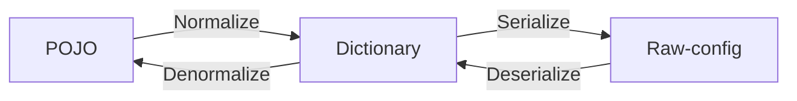
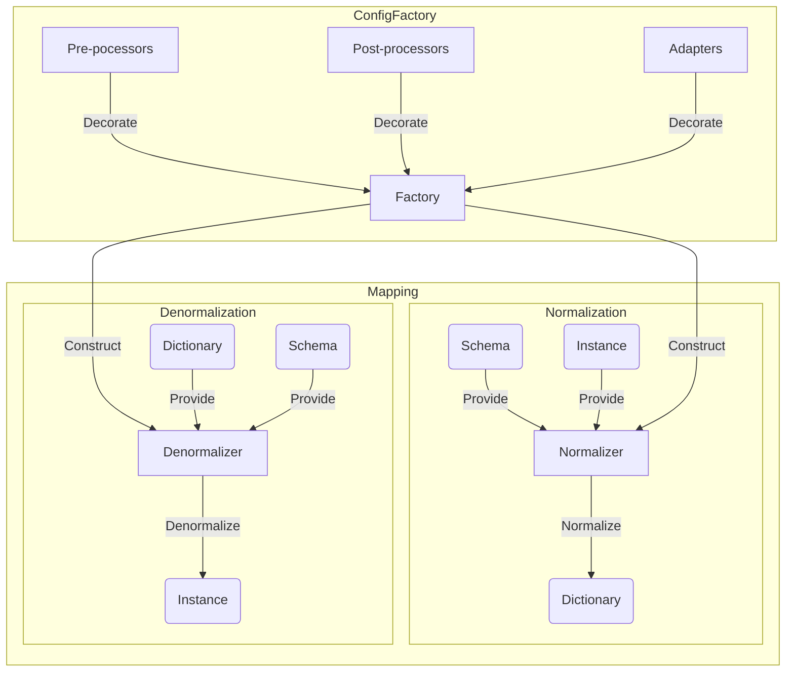
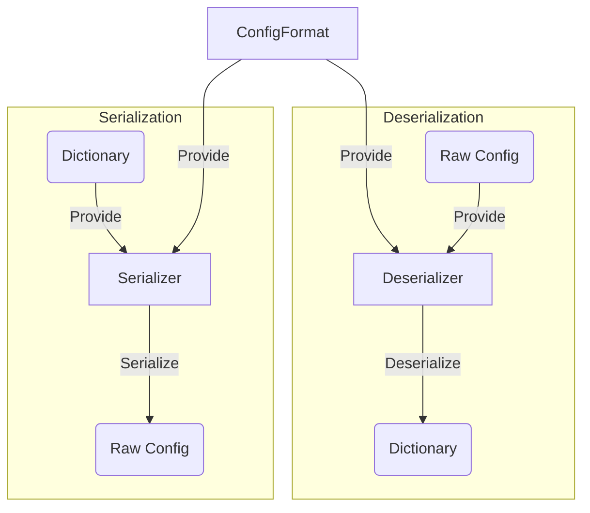
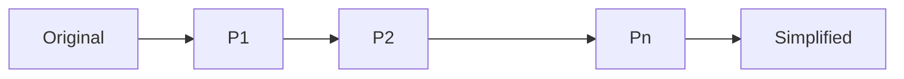

# Internal

## Introduction
- Following example codes are pseudo. Actual implementation maybe slightly different.
- See wiki: https://github.com/anhcraft/config/wiki

## Goals
- Lightweight and simple
- Loosely-couped modularity and extendability

## Reference
- [Gson Design Document](https://github.com/google/gson/blob/main/GsonDesignDocument.md)
- [Guava Reflection Explained](https://github.com/google/guava/wiki/ReflectionExplained)

# Architecture

## Modules
- `core`: contains the framework, built-in type adapters, built-in processor and common utilities
- `bukkit`: target the Bukkit platform (Minecraft server-side)
  - depends `core`
  - contains platform-dependent type adapters and processors
- `bungee`: target the Bungeecord platform (Minecraft proxy-side)
  - depends `core`
  - contains platform-dependent type adapters and processors
- `configdoc`: configuration documentation generator






# Structure

| Java           | Blueprint | Configuration |
|----------------|-----------|---------------|
| Class          | Schema    | Schema        |
| Instance, POJO | -         | Dictionary    |
| Field          | Property  | Setting       |
| Value          | -         | Value         |

## Schema
- The schema represents the structure of a class
- The schema contains none, one or many properties
- The schema is factory-dependent (see ConfigFactory below)

## Property
- A property represents a field in the associated class
  - Transient fields, synthetic fields, native fields are excluded
  - `@Exclude` to explicitly exclude a field
  - A **final** field may be a property if it does not violate rules above
- The property may contain value restrictions
- The property can be any of Java data types
- By default, the property name is derived from the field name
  - Property name conversion is customizable (see Naming Strategy below)
- The property is factory-dependent (see ConfigFactory below)

### Property annotations
- Annotations is the main approach to provide property metadata
- `@Name`: set the property primary name and aliases
  - `value` to define a list of possible name.
  - A name is valid if it is non-blank and not conflicted with previous name/aliases. If conflict exists, the name is implicitly discarded.
  - The first valid name is primary and used for normalization. Valid aliases are fallback options used solely on denormalization.
  - If no valid name exists, the default naming strategy is used: By default, the property name is derived from the field name
- `@Alias`: set the property aliases
  - `value` to define a list of possible aliases
  - It is similar to defining aliases using `@Name` except that:
    - Using `@Name`, the first valid name is the primary, the remaining valid names are aliases
    - Using `@Alias` only specifies the aliases. If `@Alias` is present while `@Name` is not, the primary name is auto-generated
  - If `@Name` and `@Alias` are both defined, the order of alias definition is `@Name` first, followed by `@Alias`
- `@Exclude`: exclude the field / let it no longer be a property
  - A static field or transient field is also ignored
  - Use `@Exclude` to avoid conflict, since other serialization library (such as Gson) ignore transient fields
- `@Describe`: describe the property
- `@Optional`: the optional only works for reference data types (including primitive wrappers) during denormalization
  - When `@Optional` is absent, the field value is `null` when the corresponding setting is absent from the Dictionary
  - When it is present, the field value will be kept as it is when the corresponding setting is absent from the Dictionary
- `@Validate`: validate the setting value
  - The difference between using `@Validate` and a separate validation is that `@Validate` integrates well with the ConfigDoc
  - When validation fails, the setting is skipped (see also: `@Optional`)
  - When validation fails, throws exception unless `silent` is set
- `@Transient`: strictly avoid normalization
  - **Note:** A transient field is ignored from the schema. However, using `@Transisent` includes the field and only avoid normalization
- `@Constant`: strictly avoid denormalization
  - **Note:** A constant/final field is included in the schema and denormalizable by default. However, using `@Constant` explicitly avoid denormalization
- `@Payload`: specify the payload type (see: Generic resolution)

### Validation
- Provides simple value validation
  + For example: `@Validate("not-null, not-empty")`
  + Multiple parameters are separated by comma
  + Space in-between is optional
  + Applies to **denormalization** only
- Not-null:
  - Enforces an object to be non-null
  - Syntax: `not-null`, `notNull`, `non-null`, `nonNull`
- Not-empty:
  - Enforces a string or a container to be non-empty
  - Syntax: `not-empty`, `notEmpty`, `non-empty`, `nonEmpty`
- Not-blank:
  - Enforces a string to be non-blank
  - Syntax: `not-blank`, `notBlank`, `non-blank`, `nonBlank`
- Range:
  - Validates a number (floating-point support)
  - Lower bound: `range=0`, `range=0|`
  - Upper bound: `range=|1.5`
  - Two-sided bound: `range=0|1.5`
- Size:
  - Validates the length of a string or the size of a container (non-negative)
  - Lower bound: `size=5`, `size=5|`
  - Upper bound: `size=|3`
  - Two-sided bound: `size=2|7`

### Naming Strategy
- When `@Name` is absent, the field name is also the property name. It is possible to change the styling, for example, enforce property name to be kebab-case.
- Field name is assumed to be **camelCase** (Java convention)
- Built-in: default, PascalCase, snake_case, kebab-case
- Naming style can be manually-defined when constructing ConfigFactory

## Dictionary
- The dictionary is the intermediate representation of configuration
- The dictionary is also called "the wrapper"
- The dictionary is independent of the schema
- The dictionary includes none, one or many settings

### Setting
- The setting has no value restrictions
- The setting must have **simple data types**

# Data types
## Simple data types
- Simple data type is a terminology used within the Dictionary context
- Simple data types are the most basic data types that any configuration format should support
  - Scalar types: 
    - Number, boolean, character
    - String
  - Compound type:
    - Dynamic-typed, ordered array
    - Container of ordered K-V entries (K must be string)
- The term _simple_ is used to distinct from _primitive_ data types which does not include string. String is a reference type in Java, however, it is a scalar type (simple type) in terms of configuration.

## Complex data types
- Beyond the context of Dictionary, a data type is said to be complex which includes:
  - Java primitives
  - Reference types such as primitive wrappers, String, Collection, etc

## Conversion
- The process of converting a complex data type into a simple data type is called normalization.
- The process of converting a simple data type into a complex data type is called denormalization.
- Conversion does not guarantee consistency. It depends on type-adapting and value processing.

# Factory
- The factory is the central instance containing built-in and custom-registered components.
- The factory name prefixes with the platform name, e.g: `BukkitConfigFactory` for the `Bukkit` module.
  - The core factory name does not have prefix
- The factory is immutable to enforce consistency and thread-safety

### Normalizer
- The normalizer is constructed from a factory
- The purpose of the normalizer is to map a complex type into a simple type, so it can be put into a Dictionary

### Denormalizer
- The denormalizer is also constructed from a factory
- The purpose of the denormalizer is to map a simple Java data type into the target complex type

### Schema Storage
Schema(s) of classes resides in the schema. The option `schemaCacheCapacity` limits the number of schemas in the cache.

## Type Adapters
- The type adapter of complex type `T` works around complex objects of type `T` and simple objects
- It is possible to register custom adapters or override existing adapter(s) including the built-in
- By default, Config does automatic type-adapting by using the schema to normalize an instance into a container, and vice versa. However, that process does not always work (see below). Using type adapter, it is possible to control the process, e.g: do complex logic, scalarize the object, etc
- Type adapter is meant provide the final result. For example, when an object of class `T` is normalized into a Dictionary, only one type adapter that is compatible to `T` will be called. Type adapting is not pipeline. Even though, it is allowed to manually call another type-adapting.
- The adapter has two main method:
  - Simplify a complex object into a simple object
  - Complexify a simple object into a complex object

### Special type adapters
- Type inferencer: the only purpose is to simplify a complex object
  - The denormalizer does not use this type adapter, instead fallback to automatic type-adapting
- Type annotator: the only purpose is to complexify a simple object
  - The normalizer does not use this type adapter, instead fallback to automatic type-adapting

### Type adapter searching
To find the type adapter compatible to type `T`, the factory starts searching from `T` up to the root of class hierarchy. Searching ends when the type adapter at a level exists. If none is found, the normalizer/denormalizer does automatic type-adapting.

### Type covariance
- For a custom adapter of type `T`, It can work with instance of type `T` or type `T' extends T`
- Normalization: It must be able to normalize type `T`. As a result, any `T' extends T` can be upcasted to type `T` and be normalized with loss of information
- Denormalization: A wrapper can be normalized into type `S` which `S` is `T` or downcast to `T' extends T`. `S` is found using type resolution.
- As the type adapter of type `T` can process any type `T' extends T`, information from subclass may be lost during normalization. To avoid, it is possible to define type adapter `T'` so that:
  - Type adapter `T'` processes type `T'` and any ` extends T'`
  - Type adapter `T` only processes type `T` and any type ` super T'`
  - Note that: `T' extends T` which mean they are under the same hierarchy

### Automatic type-adapting
- By default, the library does automatic type-adapting to cover common use cases without the need of defining type adapters (See below)

## Normalization

### Scalar Type
| Source     | Target     | Action                          |
|------------|------------|---------------------------------|
| Number     | Number     | No conversion                   |
| Boolean    | Boolean    | No conversion                   |
| Character  | Character  | No conversion                   |
| String     | String     | No conversion                   |

### Array
- Array of simple types can be skipped. If `deepClone` option is enabled, the normalizer recursively clones the array.
- Otherwise, the array is converted into a new dynamic-typing, ordered array. Its elements are recursively normalized.

### Dictionary
- The dictionary can be skipped. If `deepClone` option is enabled, the normalizer recursively clones the dictionary.

### Other reference types
- First, the normalizer searches for the nearest type adapter from the supplied class up to the root of class hierarchy. If one exists, which is not a type annotator, the normalizer forwards the process to that type adapter. The normalizer throws an exception if the output is not a simple object.
- If the type adapter exists as a type annotator, or no type adapter exists, the normalizer does automatic type-adapting.

### Automatic type-adapting
- Automatic type-adapting (within normalization context) means to convert a complex object into a Dictionary using the compatible schema.
- A schema of type `S` is compatible to the complex object of type `T` if `S` is `T` or `S` is supertype of `T`
- First, the normalizer checks if the complex object is a Dictionary. If so, it does soft-copy or deep-copy into the destination Dictionary.
- Otherwise, the normalizer uses the schema to recursively normalize every property.
  + `@Transient` property is skipped
  + `null` value can remove the corresponding setting in the destination Dictionary (if the dictionary contains existing settings)
  + Default value, empty array and empty dictionary may be omitted
  + The normalizer does a final simple-type validation

## Denormalization
- The denormalization is much complexer than the normalization:
  - Relies on the given type which may be an interface (abstract class), not an implementation class, which means it is required to correctly find out the appropriate implementation class and instantiate it
  - Due to type erasure, it is impossible to know the exact type of generic fields
  - Dynamic value resolution due to end-user convenience: cast string to a scalar value and vice versa, wrap a scalar value in compound type, etc

### Scalar Type
- To denormalize scalar values, the library uses type annotator. A type annotator is a special type adapter that serves denormalization only.

| Source    | Target             | Action                                               |
|-----------|--------------------|------------------------------------------------------|
| Number    | `? extends Number` | Casting                                              |
| Number    | Boolean            | `true` if positive                                   |
| Number    | Character          | Unicode codepoint                                    |
| Number    | String             | Stringify                                            |
| Boolean   | Boolean            | No conversion                                        |
| Boolean   | Number             | `1` if true, `0` otherwise                           |
| Boolean   | Character          | `1` if true, `0` otherwise                           |
| Boolean   | String             | `true` if true, `false` otherwise                    |
| Character | Character          | No conversion                                        |
| Character | Number             | Unicode codepoint                                    |
| Character | Boolean            | Must be `1`, `0` (case-insensitive)                  |
| Character | String             | Stringify                                            |
| String    | String             | No conversion                                        |
| String    | Number             | Parse number                                         |
| String    | Boolean            | Must be `true`, `false`, `1`, `0` (case-insensitive) |
| String    | Character          | The first character, or `\0` if empty                |

### Array
| Source | Target | Action                                           |
|--------|--------|:-------------------------------------------------|
| Scalar | Array  | Denormalize and instantiate an array of length 1 |
| Array  | Array  | Recursive conversion                             |

### Dictionary
- When the target type is a Dictionary or a supertype of Dictionary, the library copies direct reference to the source, or deep clone if `deepClone` is enabled

### Other reference types
- First, the denormalizer searches for the nearest type adapter from the supplied class up to the root of class hierarchy. If one exists, which is not a type inferencer, the denormalizer forwards the process to that type adapter.
- If the type adapter exists as a type inferencer, or no type adapter exists, the denormalizer does automatic type-adapting.

### Automatic type-adapting
- Automatic type-adapting (within denormalization context) means to convert/write a Dictionary into an instance using the compatible schema.
- A schema of type `S` is compatible to the complex object of type `T` if `S` is `T` or `S` is supertype of `T`
- First, the denormalizer checks if the simple object is a Dictionary, otherwise, the output is always `null` or the process terminates (if the target instance is given)
  - The instance can be supplied or automatically constructed.
  - When constructs an instance, the denormalizer searches for the default constructor (empty parameters), if none exists, it forces instantiation without invoking any constructor
- Otherwise, the denormalizer uses the schema to recursively denormalize every property.
  + `@Constant` property is skipped
  + It searches for the corresponding setting in the dictionary using the primary name, if not exists, fallback into other aliases (in order)
  + `null` value is skipped if the property is `@Optional`
  + If the target type is primitive, `null` value is skipped
  + If the value is non-null, the denormalizer checks if it is compatible to the target type
  + Validates the value, if success, writes to the field

## Common type support

### Java Collections
Common, mutable data structures are preferred.


To denormalize collections and maps, the field must supply the type of elements (See: Generic resolution)

### Enum
For user convenience, the enum name is converted to lowercase upon normalization, and convert back to uppercase upon denormalization

### Other reference types

| Complex Type | Simple Type |
|--------------|-------------|
| UUID         | String      |
| URL          | String      |
| URI          | String      |

## Generic resolution
From the example above:
```java
@Configurable
public class Person {
  public Map<String, MyModel> relationship;
  public List<Job> jobs;
  public ArrayList<Pet> pets;
  public AbstractList emails;
}
```
Due to type erasure at compile-time, the code above turns into:
```java
@Configurable
public class Person {
  public Map relationship;
  public List jobs;
  public ArrayList pets;
  public AbstractList emails;
}
```

### Type Adapter
Type adapter is lookup based on the raw type

| Type                   | Raw Type     |
|------------------------|--------------|
| `Map<String, MyModel>` | Map          |
| `List<Job>`            | List         |
| `ArrayList<Pet>`       | ArrayList    |
| `AbstractList`         | AbstractList |

### Normalization
For container types such as ones in the Collections API, normalization relies on the type of each element in the container. This may result in variance of simple objects. Therefore, for simple types, an array is dynamically-typed, and a K-V container has no restriction on the value type (except that the key must be a string)

### Denormalization
- Classes use generics to take advantage of type variables, for example, a `List<String>` means to store `String` only. At compile-time, type erasure happens, and there is no restriction of parameter types at runtime. Without knowing the actual type, it is impossible to denormalize elements in a container because there is no way to know its schema. Besides that, it is critical to avoid heap pollution by ensuring type compatibility of elements in the container. For example:
```java
@Configurable
public class Person {
  public List jobs;
  
  public Job getJob(int i) {
      return jobs.get(i); // Is the element at "i" a Job ?
  }
}
```
- Java does record type variables via Reflection, so it is possible to exact the schema to denormalize elements. This is the default behaviour.
```java
@Configurable
public class Person {
  public List<Job> jobs; // runtime: List; generics parameters=[Job]
}
```
- However, certain use cases need other way to provide actual types. Consider the following code, the list accepts all `T extends Job`. When denormalizing the list, which subtype of `Job` should it use?
```java
@Configurable
public class Person<T extends Job> {
  public List<T> jobs;
}
```
- `@Payload` is an optional annotation that explicitly specifies the actual types. It uses the same order as type variables of the associated field.
```java
@Configurable
public class Person<T extends Job> {
  @Payload(JobImpl.class)
  public List<T> jobs;
}
```
```java
@Configurable
public class Person<T extends Job> {
  @Payload(JobImpl[].class)
  public List<T[]> jobs;
}
```
```java
@Configurable
public class Person<T extends Job> {
  @Payload({String.class, })
  public Map<String, List<T[]>[]> jobs;
}
```
- `@Payload` means to provide a simple approach. Exact type checking is unsupported. Variance of element implementation is unsupported. These complex use cases must use type adapters.

## Recursive (de)normalization
```java
@Configurable
public class Warehouse {
  public List<Item[]> stacks;
}
@Configurable
public class Item {
  public String name;
  public int stock;
}
```
```yml
stacks:
  - - name: Candy
      stock: 5
    - name: Snack
      stock: 3
  - - name: Coca
      stock: 2
```

## Inherited (de)normalization
```java
@Configurable
public class Parent {
}
//@Configurable // not needed
public class Child extends Parent {
}
```

## Normalizablity
- Built-in type adapters:
  + Primitives
  + Dictionary of primitives
  + String
  + Enum of normalizable types
  + Array of normalizable types
  + Java Collections with tuple of normalizable types
    + `Collection<E>` with normalizable `E` 
    + `Map<K, V>` with `K` can be normalized into string and `V` is a normalizable type
  + URL, URI, UUID
- `@Configurable` class and its subclasses

## Processors
- Processors are annotated methods that can process before/after (de)normalization
- The annotation only works for instance methods
- Private access is recommended to encapsulate the code
- Processors are inherited from ancestors if the root is a `@Configurable` class

### Property Normalizer
- The Normalizer changes the complex value of a property before it is simplified
  - The method takes a single parameter which is the value of the previous Normalizer (or the property type if it is the first one)
  - An optional parameter is the wrapper instance
  - The returning type can be arbitrary, and will be the input type of the next Normalizer. If it is `void`, the current parameter type will be the next input type
  - There is no immutability guarantee
- After passing through all Normalizer, if the value is not simple object, the built-in normalization takes place. If the value is still not simple object, it is discarded

- For example, append a prefix to the item name upon normalization
```java
@Configurable
public class Item {
  public String name;
  public int stock;

  @Normalizer("name")
  private String processName(String value) {
    return String.format("x%d %s", stock, value);
  }
}
```

### Property Denormalizer
- The Denormalizer changes the simple value of a property before it is mapped to the instance
  - The method takes a single parameter which is the value of the previous Denormalizer (or the simple type if it is the first one). 
  - If the value type is not compatible to the desired type, the method is discarded.
  - An optional parameter is the wrapper instance
  - The returning type can be arbitrary, and will be the input type of the next Denormalizer. If it is `void`, the current parameter type will be the next input type
  - There is no immutability guarantee
- After passing through all Denormalizer, if the value is not compatible to the property type, the built-in denormalization takes place. If the value is still not compatible to the property type, it is discarded
- To validate an integer upon denormalization
```java
@Configurable
public class Item {
  public String name;
  public int stock;

  @Denormalizer("stock")
  private void processStock(int value) {
    if (value < 0) 
        throw new IllegalArgumentException("stock must be non-negative");
  }
}
```
- For example, inject an ID to each object in a map
```java
@Configurable
public class Inventory { 
  public Map<String, Item> items;

  @Denormalizer("items")
  private void processItems(Container container) {
      for (String prop : container.properties()) {
        container.get(prop).set("id", prop);
      }
  }
}
```

### Instance Normalizer
- A Normalizer that has no property specified is associated with the instance
- The annotation has a field `at` to control pre-/post-call (defaults to `pre`)
- For example, to validate a field as a prerequisite for normalization
```java
@Configurable
public class Bag { 
  public Item[] items;

  @Normalizer
  private void check() {
    if (items.length == 0)
      throw new IllegalArgumentException("items must not be empty");
  }
}
```

### Instance Denormalizer
- A Denormalizer that has no property specified is associated with the instance
- The annotation has a field `at` to control pre-/post-call (defaults to `post`)
- For example, to enforce immutability after denormalization
```java
@Configurable
public class Inventory {
    public Map<String, Item> items;

    @Denormalizer(at=Denormalizer.POST)
    private void callback() {
        if (items != null)
            items = Map.of(items);
    }
}
```

### KeyInjector
- A key injector works on a Map. It takes the key and injects it to a property of the corresponding value
- Key injection happens once the object is instantiated and denormalized. Therefore, it overrides all previous values set.
- Key injection is in denormalization process

```java
@Configurable
public class Inventory {
  @KeyInjector("id")
  public Map<String, Item> items;
}

@Configurable
public class Item {
  @Exclude
  public String id;
  public String name;
  public int stock;
}
```

### Fallback
- The fallback takes all remaining K-V of the current wrapper and put them into the annotated K-V container or Map
- Properties fallback is in denormalization process
- For example:
```yaml
stack:
  name: Snack
  stock: 3
coca:
  name: Coca
  stock: 2
bread:
  name: Bread
  stock: 5
```
```java
@Configurable
public class Inventory {
  public Item bread; // bread

  @Fallback
  public Map<String, Item> items; // snack, coca
}
```

## ASM support
Runtime bytecode manipulation is unsupported. Since schema and property is factory-dependent (not singleton), the use of ASM may lead to inconsistencies between different components.
