# Internal

## Introduction
- Following examples are pseudo code. Actual implementation maybe slightly different
- Based on the content in [Overview.md](Overview.md)

## Goals
Simple, lightweight, adaptable and extendable:
- Simple: the library should be kept as simple as possible allowing future additions, ease of use and long-term maintainability
- Lightweight: the library should be lightweight to keep the size as low as possible and consume a minimal amount of CPU and memory usage
- Adaptable: the library can be used independently or integrate with other libraries as needed
- Extendable: loosely-couped modularity and extendability

## Reference
- [Gson Design Document](https://github.com/google/gson/blob/main/GsonDesignDocument.md)
- [Guava Reflection Explained](https://github.com/google/guava/wiki/ReflectionExplained)

# Architecture

## Terminologies
1. `Object` denotes an instance of a reference type `T`
2. `Configutation` (or `Config`) denotes a human-readable text expressing an arrangement to the system
3. `Configuration format` is a specific representation that defines the syntax and structure of configuration
4. `Schema` (or `model`) depicts the structure of a configuration without being fixed into any particular `Configuration format`
5. `Serialization` is the process of turning an `Object` into a `Configuration text` by `mapping` it in respect of the representation (JSON/XML/YAML/etc)
6. `Deserialization` (or `Parsing`) is the process of turning a `Configuration text` into an `Object` by `mapping` it in respect of the `schema`
7. `Mapping` implies a deterministic one-to-many or many-to-one transformation
8. `Conversion` implies a deterministic one-to-one transformation
9. `Simple type` denotes widely-supported data types by all `configuration format` including string, number, boolean, array of `Simple type` and configuration sections of string-key and `Simple typed`-value
10. `Complex type` denotes any Java data type including `Simple type`
11. `Normalization` (or `Simplification`) is the process of turning a `Complex type` into a `Simple type`
12. `Denormalization` (or `Complexification`) is the process of turning a `Simple type` into a `Complex type` with the help of `type inference`
13. `Type inference` is the process of infer an appropriate `Complex type` to turn a `Simple object` into a `Complex object`
14. `Simple object` denotes  `Simple typed` `Object`
15. `Complex object` denotes  `Complex typed` `Object`
16. `Dictionary` is the reserved `Simple typed` `Object` representing a configuration section

## Modules
- `core`: contains the framework, built-in type adapters, built-in processor and common utilities
- `configdoc`: configuration documentation generator

## Flows
- Normalize and denormalize objects
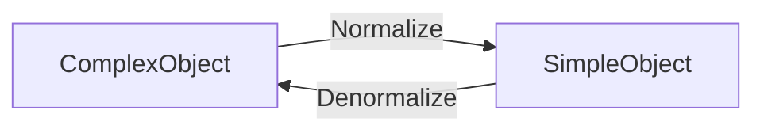
- A three-stages process, two endpoints are `Object` and `Configuration` and an intermediary layer `Dictionary` 
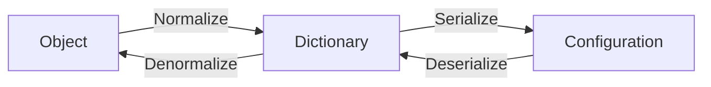
- A top-down overview of normalization/denormalization
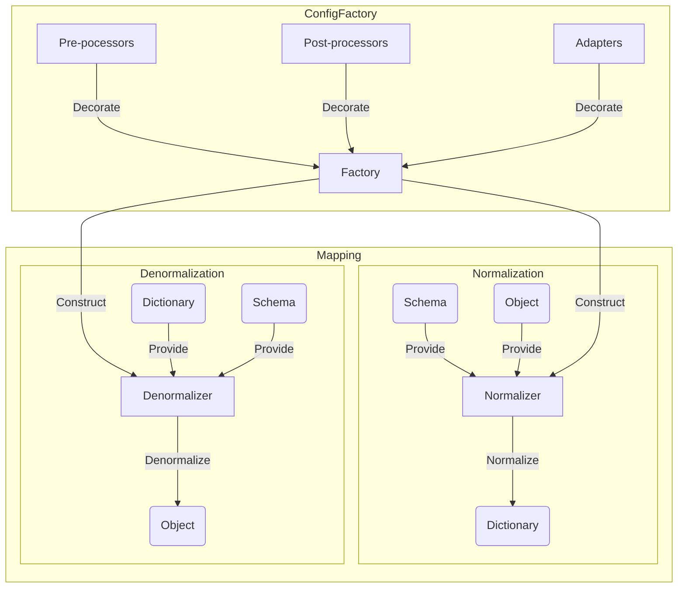
- Serialize/Deserialize between `Dictionary` and `Configuration`
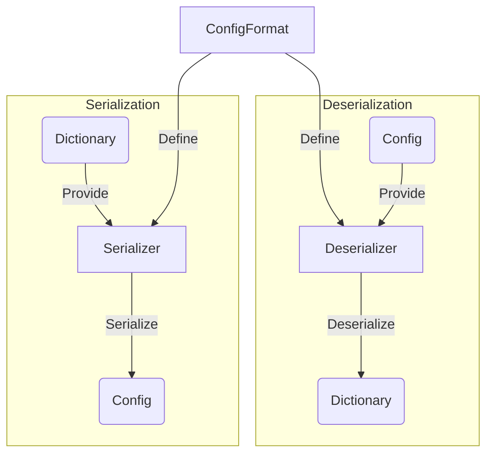

## Official platform packages
- `bukkit`: target the Bukkit platform (Minecraft server-side)
  - depends `core`
  - contains platform-dependent type adapters and processors
- `bungee`: target the Bungeecord platform (Minecraft proxy-side)
  - depends `core`
  - contains platform-dependent type adapters and processors

# Structure

| Instance of `T` | Object     | Dictionary                       |
|-----------------|------------|----------------------------------|
| Data type       | `Class<T>` | Dictionary                       |
| Model           | Schema     | Schemaless<br/>Dictionary schema |
| Field           | Property   | Setting                          |

## Schema
- The schema (or model) is an immutable top-down view of the structure of a configuration at runtime
- The schema contains none, one or many properties
- The schema is factory-dependent (see ConfigFactory below)

### Class schema
- The schema inferred from a respective class in a _declarative_ manner
- Depicts the **exposed** structure of a class
- Provides the view of a class available at runtime
- All classes have their own class schemas lazily generated using reflection

### Dictionary schema
- The schema is built dynamically in an _imperative_ manner
- Provides the view of a _virtual_ class which does not exist at runtime

### Schema construction

|               | Description                                                                                    | Class Schema | Dictionary Schema |
|---------------|------------------------------------------------------------------------------------------------|--------------|-------------------|
| Builder       | Step-by-step build a freestyle schema                                                          |              | ✔                 |
| Reflection    | Using Reflection API to generate schema based on a class available at runtime                  | ✔            |                   |
| Code scanning | Using static code analysis to generate schema without running or including the code at runtime |              | ✔                 |

- A class schema can be converted into a dictionary schema but not vice versa

## Property
- A property belongs to a schema and represents an individual configuration setting
- The type of property is the data type of the value it holds
- The property is factory-dependent (see ConfigFactory below)

### Property in a class schema
- Each property maps into exactly one field in the respective class
- Each field in the class maps into one or _none_ property
- Transient fields, synthetic fields, native fields are excluded
  - `@Exclude` to explicitly exclude a field
  - A **final** field may be a property if it does not violate rules above
- By default, the property name is derived from the field name
  - Property name conversion is customizable (see Naming Policy)
  - Property name can be customized (see Naming Strategy)
- The property type equals to the type of the corresponding field

#### Naming Policy
- When `@Name` is absent, the field name is also the property name. It is possible to change the styling, for example, enforce property name to be kebab-case.
- Field name is assumed to be **camelCase** (Java convention)
- Built-in: default, PascalCase, snake_case, kebab-case
- Naming policy can be manually-defined when constructing ConfigFactory
- Custom naming policy must follow a bijective function, otherwise an exception is raised during schema creation (see: Naming Strategy)

#### Naming Strategy
- First, each property is named as its corresponding field's name after applying Naming Policy. If naming collision happens, e.g. for two distinct properties, a custom naming policy outputs the same name, an exception throws.
- It is initially guaranteed that at this time naming follows a bijective function:
  - Every name in a schema is unique
  - Two distinct properties must have two distinct names
  - Two distinct names are mapped into two distinct properties
  - The initial name of each property is called primary name
- The schema scanner inspects every property for `@Name` and `@Alias` in order:
  - If `@Name` exists, the new primary name is the first valid name. A valid name is defined as *non-blank and unique to existing names*. The valid name does not apply Naming Policy since it is already a custom-defined name. The old primary name is discarded, and thus can be used later.
  - If `@Name` exists with more than one valid name. From the second valid name, each one is considered an alias.
  - Then, checks for `@Alias` with the same rule as above. All names defined in `@Alias` are considered as aliases. They also do not apply Naming Policy.
- To conclude, naming in a schema must follow the following rules:
  - Every name in a schema is unique
  - Two distinct properties must have two set of unique names
  - Two distinct names may be mapped to the same property
  - Each property must have a primary name and an optional set of aliases
  - Naming in a schema follows an onto function `Name → Property`

#### Annotations
- Annotations is the main approach to provide **class properties**
- `@Name`: set the property primary name and aliases
  - `value` to define a list of possible names
  - See: Naming Strategy
- `@Alias`: set the property aliases
  - `value` to define a list of possible aliases
  - See: Naming Strategy
- `@Exclude`: exclude the field / let it no longer be a property
  - Transient fields, synthetic fields, native fields are always excluded by default
  - Prefer `@Exclude` over `transient` to avoid conflict since other serialization libraries (such as Gson, Jackson, etc.) ignore transient fields
- `@Describe`: describe the property
- `@Optional`: the optional only works for reference data types (including primitive wrappers) during denormalization
  - When `@Optional` is absent, the field value is `null` when the corresponding setting is absent from the Dictionary
  - When `@Optional` is present, keep the value as it is when the corresponding setting is absent from the Dictionary
- `@Validate`: validate the setting value
  - The difference between using `@Validate` and a separate validation is that `@Validate` integrates well with the ConfigDoc
  - When validation fails, the setting is skipped (see also: `@Optional`)
  - When validation fails, throws exception unless `silent` is set
- `@Transient`: strictly avoid normalization
  - **Note:** A transient field is ignored from the schema. However, using `@Transisent` includes the field and only avoid normalization
- `@Constant`: strictly avoid denormalization
  - **Note:** A constant/final field maybe included in the schema and denormalizable. Using `@Constant` explicitly avoid denormalization

### Property in a dictionary schema
- The dictionary schema is generated imperatively, so as its property
- Name and Type is defined when building the property

### Validation
- Provides simple value validation
  + For example: `@Validate("not-null, not-empty")`
  + Checks are separated by comma
  + Space in-between is skipped
  + Applies to **denormalization** only
- Not-null:
  - Enforces an object to be non-null
  - Syntax: `not-null`, `notNull`, `non-null`, `nonNull`
- Not-empty:
  - Enforces a string or a container to be non-empty
  - Syntax: `not-empty`, `notEmpty`, `non-empty`, `nonEmpty`
- Not-blank:
  - Enforces a string to be non-blank
  - Syntax: `not-blank`, `notBlank`, `non-blank`, `nonBlank`
- Range:
  - Validates a number (floating-point support)
  - Lower bound: `range=0`, `range=0|`
  - Upper bound: `range=|1.5`
  - Two-sided bound: `range=0|1.5`
- Size:
  - Validates the length of a string or the size of a container (non-negative)
  - Lower bound: `size=5`, `size=5|`
  - Upper bound: `size=|3`
  - Two-sided bound: `size=2|7`

## Dictionary
- The dictionary is a K-V container of simple objects
  + The key must be string
  + The value can be any of simple types unless the dictionary is constrained by a schema which defines the setting type
- The dictionary includes none, one or many settings

### Schemaless dictionary
- The dictionary has no schema associated, as such, its content grows dynamically and fit any simple objects
```
Dictionary = {
  name = "Bob"
  age = 7
  emails = ["test@gmail.com"]
}
```

### Constrained dictionary
- The dictionary is constrained by a dictionary schema which restricts the type of values
```
Dictionary: {
  name: string
  age: int
  emails: string[]
} = {
  name = "Bob"
  age = 7
  emails = ["test@gmail.com"]
}
```

# Data types
## Simple data types
- Simple data type is a terminology used within the Dictionary context
- Simple data types are the most basic data types that any configuration format should support
  - Scalar types: 
    - Number, boolean, character
    - String
  - Compound type:
    - Dynamic-typed, ordered array
    - Container of ordered K-V entries (K must be string, V must be simple typed)

## Complex data types
- Beyond the context of Dictionary, a data type is said to be complex which includes:
  - Java primitives
  - Reference types such as primitive wrappers, String, Collection, etc

## Mapping
- The process of mapping a complex data type into a simple data type is called normalization
- The process of mapping a simple data type into a complex data type is called denormalization

# Factory
- The factory is the central instance containing built-in and custom-registered components
- The factory is immutable to enforce consistency and thread-safety

### Normalizer
- The normalizer is constructed from a factory
- The purpose of the normalizer is to map a complex type into a simple type so it can be put into a Dictionary

### Denormalizer
- The denormalizer is also constructed from a factory
- The purpose of the denormalizer is to map a simple Java data type into the target complex type

### Schema Storage
- Schema(s) of classes resides in the schema
- The option `schemaCacheCapacity` limits the number of schemas in the cache

## Type Adapters
- The type adapter of complex type `T` works around complex objects of type `T` or subtypes of `T` and simple objects
- It is possible to register custom adapters or override existing adapter(s) including the built-in
- By default, Config does automatic type-adapting by using the schema to normalize an instance into a container, and vice versa. However, that process does not always work (see below). Using type adapter, it is possible to control the process, e.g: do complex logic, scalarize the object, etc
- Type adapter must provide the final result. For example, when an object of class `T` is normalized into a Dictionary, only one type adapter that is compatible to `T` will be called. Type adapting is not pipelined. Nevertheless, it is allowed to manually call another type-adapting
- The adapter has two main method:
  - Simplify a complex object into a simple object
  - Complexify a simple object into a complex object

### Special type adapters
- Type inferencer: the only purpose is to simplify a complex object
  - The denormalizer skips this type adapter and fallbacks to use automatic type-adapting
- Type annotator: the only purpose is to complexify a simple object
  - The normalizer skips this type adapter and fallbacks to use automatic type-adapting

### Type adapter searching
- To find the type adapter compatible to an object of type `T`, the factory starts searching from `T` up to the root of class hierarchy. Searching ends when the type adapter at a level exists. If none is found, the normalizer/denormalizer does automatic type-adapting

### Type covariance
- For a custom adapter of type `T`, It can work with instance of type `T` or type `T' extends T`
- Normalization: It must be able to normalize type `T`. As a result, any `T' extends T` can be upcasted to type `T` and be normalized with loss of information
- Denormalization: A wrapper can be normalized into type `S` which `S` is `T` or downcast to `T' extends T`. `S` is found using type resolution.
- As the type adapter of type `T` can process any type `T' extends T`, information from subclass maybe lost during normalization. To mitigate, it is possible to define type adapter `T'` so that:
  - Type adapter `T'` processes type `T'` and any ` extends T'`
  - Type adapter `T` only processes type `T` and any type ` super T'`
  - Note that: `T' extends T` which mean they are under the same hierarchy

### Automatic type-adapting
- By default, the library does automatic type-adapting to cover common use cases without the need of defining type adapters (See below)

## Normalization

### Scalar Type
| Source     | Target     | Action                          |
|------------|------------|---------------------------------|
| Number     | Number     | No conversion                   |
| Boolean    | Boolean    | No conversion                   |
| Character  | Character  | No conversion                   |
| String     | String     | No conversion                   |

### Array
- Array of simple types can be skipped. If `deepClone` option is enabled, the normalizer recursively clones the array.
- Otherwise, the array is converted into a new dynamic-typing, ordered array. Its elements are recursively normalized.

### Dictionary
- The dictionary can be skipped. If `deepClone` option is enabled, the normalizer recursively clones the dictionary.

### Other reference types
- First, the normalizer searches for the nearest type adapter from the supplied class up to the root of class hierarchy. If one exists, which is not a type annotator, the normalizer forwards the process to that type adapter. The normalizer throws an exception if the output is not a simple object.
- If the type adapter exists as a type annotator, or no type adapter exists, the normalizer does automatic type-adapting.

### Automatic type-adapting
- Automatic type-adapting (within normalization context) means to convert a complex object into a Dictionary using the compatible schema.
- A schema of type `S` is compatible to the complex object of type `T` if `S` is `T` or `S` is supertype of `T`
- First, the normalizer checks if the complex object is a Dictionary. If so, it does soft-copy or deep-copy into the destination Dictionary.
- Otherwise, the normalizer uses the schema to recursively normalize every property.
  + `@Transient` property is skipped
  + `null` value can remove the corresponding setting in the destination Dictionary (if the dictionary contains existing settings)
  + Default value, empty array and empty dictionary may be omitted
  + The normalizer does a final simple-type validation

## Denormalization
- The denormalization is much complexer than the normalization:
  - Relies on the given type which may be an interface (abstract class), not an implementation class, which means it is required to correctly find out the appropriate implementation class and instantiate it
  - Due to type erasure, it is impossible to know the exact type of generic-typed fields
  - Dynamic typing workarounds: cast string to a scalar value and vice versa, wrap a scalar value in compound type, etc

### Scalar Type
- To denormalize scalar values, the library uses type annotator. A type annotator is a special type adapter that serves denormalization only.

| Source    | Target             | Action                                               |
|-----------|--------------------|------------------------------------------------------|
| Number    | `? extends Number` | Casting                                              |
| Number    | Boolean            | `true` if positive                                   |
| Number    | Character          | Unicode codepoint                                    |
| Number    | String             | Stringify                                            |
| Boolean   | Boolean            | No conversion                                        |
| Boolean   | Number             | `1` if true, `0` otherwise                           |
| Boolean   | Character          | `1` if true, `0` otherwise                           |
| Boolean   | String             | `true` if true, `false` otherwise                    |
| Character | Character          | No conversion                                        |
| Character | Number             | Unicode codepoint                                    |
| Character | Boolean            | Must be `1`, `0` (case-insensitive)                  |
| Character | String             | Stringify                                            |
| String    | String             | No conversion                                        |
| String    | Number             | Parse number                                         |
| String    | Boolean            | Must be `true`, `false`, `1`, `0` (case-insensitive) |
| String    | Character          | The first character, or `\0` if empty                |

### Array
| Source | Target | Action                                           |
|--------|--------|:-------------------------------------------------|
| Scalar | Array  | Denormalize and instantiate an array of length 1 |
| Array  | Array  | Recursive conversion                             |

### Dictionary
- When the target type is a Dictionary or a supertype of Dictionary, the library copies direct reference to the source, or deep clone if `deepClone` is enabled

### Other reference types
- First, the denormalizer searches for the nearest type adapter from the supplied class up to the root of class hierarchy. If one exists, which is not a type inferencer, the denormalizer forwards the process to that type adapter.
- If the type adapter exists as a type inferencer, or no type adapter exists, the denormalizer does automatic type-adapting.

### Automatic type-adapting
- Automatic type-adapting (within denormalization context) means to convert/write a Dictionary into an instance using the compatible schema.
- A schema of type `S` is compatible to the complex object of type `T` if `S` is `T` or `S` is supertype of `T`
- First, the denormalizer checks if the simple object is a Dictionary, otherwise, the output is always `null` or the process terminates (if the target instance is given)
  - The instance can be supplied or automatically constructed.
  - When constructs an instance, the denormalizer searches for the default constructor (empty parameters), if none exists, it forces instantiation without invoking any constructor
- Otherwise, the denormalizer uses the schema to recursively denormalize every property.
  + `@Constant` property is skipped
  + It searches for the corresponding setting in the dictionary using the primary name, if not exists, fallback into other aliases (in order)
  + `null` value is skipped if the property is `@Optional`
  + If the target type is primitive, `null` value is skipped
  + If the value is non-null, the denormalizer checks if it is compatible to the target type
  + Validates the value, if success, writes to the field

## Common type support

### Java Collections
Common, mutable data structures are preferred.


To denormalize collections and maps, the field must supply the type of elements (See: Generic resolution)
  - If the source is a scalar value, it is auto-converted into an array of length 1 and then continue converting into an appropriate collection

### Enum
For user convenience, the enum name is converted to lowercase upon normalization, and convert back to uppercase upon denormalization

### Other reference types

| Complex Type | Simple Type |
|--------------|-------------|
| UUID         | String      |
| URL          | String      |
| URI          | String      |

## Generic resolution
From the example above:
```java
public class Person {
  public Map<String, MyModel> relationship;
  public List<Job> jobs;
  public AbstractList emails;
}
```
Due to type erasure at compile-time, the code above turns into:
```java
public class Person {
  public Map relationship;
  public List jobs;
  public AbstractList emails;
}
```

### Type Adapter
Type adapter lookup relies on the raw type

| Type                   | Raw Type     |
|------------------------|--------------|
| `Map<String, MyModel>` | Map          |
| `List<Job>`            | List         |
| `AbstractList`         | AbstractList |

### Normalization
For container types such as ones in the Collections API, normalization relies on the actual type of each element in the container. This may result in variance of simple objects. Therefore, for simple types, an array is dynamically-typed, and a K-V container has no fixed restriction on the value type (the key must be a string and the value must be simple typed)

### Denormalization
- Classes use generics to take advantage of type variables, for example, a `List<String>` means to store `String` only. At compile-time, type erasure happens, and there is no restriction of parameter types at runtime. Without knowing the actual type, it is impossible to denormalize into a container because there is no way to know its payload type. For example:
```java
public class Person {
  public List jobs;
  
  public Job getJob(int i) {
      return jobs.get(i); // Is the element at "i" a Job ?
  }
}
```
- Java does record parameterized types bound to fields, so it is possible use Reflection and exact full type information
```java
public class Person {
  public List<Job> jobs; // runtime: List; actual arguments=[Job]
}

public Person createPerson() {
    return new Person();
}
```
- However, when there is type variable bound to the class, it is impossible to know the actual type because Reflection does not support retrieving type information from local variables, method parameters, etc
```java
public class Person<T extends Job> {
  public List<T> jobs;
}

public static Person<PartTimeJob> createStudent() {
  return new Person<PartTimeJob>(); // erasure -> new Person()
}

// the field has type Person<PartTimeJob>
public static Person<PartTimeJob> SINGLETON = createStudent();

public static void main(String[] args) throws Exception {
    // cannot get type info from a local variable
    Person<PartTimeJob> person = createStudent();

    // it is impossible to get type info for value passed
    continueOperation(person);
}
```
- There is a trick called Super Type Tokens which is widely-used used including Gson. An old blog from Neal Gafter explained the trick: https://gafter.blogspot.com/2006/12/super-type-tokens.html
- Basically, if there is a parameterized class extending a parameterized superclass, and the subclass provides actual type parameters, then it is possible to retrieve type info:
```java
public static void main(String[] args) {
    // Create an anonymous class extending Person and instantiate it
    Person<PartTimeJob> person = new Person<>(){};
    // the diamond syntax above is similar to
    // Person<PartTimeJob> person = new Person<PartTimeJob>(){};

    Type superclass = person.getClass().getGenericSuperclass();
    Type actualType = ((ParameterizedType) superclass).getActualTypeArguments()[0];
}
```
- Not all classes are extendable, especially when developers want to work with external classes. So, some library introduces a type resolver (e.g in Gson, it is called TypeToken). The type resolver can capture type using Super Type Tokens trick
```java
public abstract class TypeResolver<T> {
    public final Type capture() {
        Type superclass = getClass().getGenericSuperclass();
        return ((ParameterizedType) superclass).getActualTypeArguments()[0];
    }
}

public static void main(String[] args) {
    Person<PartTimeJob> person = new Person<>();
    Type type = new TypeResolver<Person<PartTimeJob>>(){}.capture();
    denormalize(person, type);
}
```

### Complex use cases
For complex use cases, it is required to handle manually using type adapter

## Processors
- In certain use cases, it is unnecessary to create type adapter for a certain type because of following reasons:
  + Minimize code duplication. For example, there is a validation in the constructor, what if that can also be used in denormalization
  + Encapsulate the logic in that class and prevent inheritance. On the other hand, type adapter lookup works for subtype.
  + Validate the value (without using `@Validate`). Using type adapter means to transform the value, so validation is not a suitable use case here.
  + Access to private, package-private class members
- Processors are annotated instance methods that can process values
- There are two types: normalization processor and denormalization processor
- A processor can bound to multiple properties. A property is allowed to have one for each type of processor (in total is 2)
- Processors are not inherited from superclasses or interfaces

### Normalization Processor
- The `@Normalizer` annotation represents the normalization processor for a specific property.
- Since the processor is an instance method, it can directly get the value from the corresponding field.
- The syntax of normalization processor is inspired from type adapter with difference:
  - The `context` parameter is optional
  - **No** `value` parameter: the value can be obtained directly
  - **No** `type` parameter: the actual type is determined in source code
  - Return type must be non-void
- Option `name` to specify the property name
- Option `strategy` controls how it behaves:
  - `replace`: replaces the automatic type-adapting. This processor must take the value from the corresponding field directly and returns the simplified value. (**default**)
  - `before`: this processor executes before automatic type-adapting, it provides a new complex value. Thereby, the normalizer takes the value from this processor instead of getting from the corresponding field.

#### Illustration of two strategies
- Without using processor:
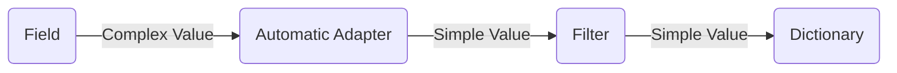
- Using `replace` strategy:
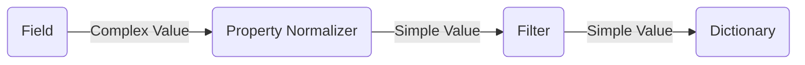
- Using `before` strategy:
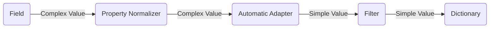

#### Syntax
```java
public class Log {
  private long timestamp;

  // "replace" strategy
  // - Directly provide the simplified value
  @Normalizer("timestamp") // "replace" is the default strategy
  private String processTimestamp() { // may add "Context" parameter (optionally)
    return new Date(timestamp).toString();
  }
}
```
```java
public class Log {
  private long timestamp;

  // "before" strategy
  // - Directly provide the field value
  @Normalizer(value = "a", strategy = Strategy.BEFORE)
  private long provideTimestamp() { // may add "Context" parameter (optionally)
    return new Date(timestamp).getTime();
  }
}
```

### Denormalization Processor
- The `@Denormalizer` annotation represents the denormalization processor for a specific property.
- The syntax of denormalization processor is inspired from type adapter with difference:
  - The `value` parameter is required to supply the simple value
  - The `context` parameter is optional
  - **No** `type` parameter: the actual type is determined in source code
  - If the return type is void, it is possible to set the value directly into the field
- Option `name` to specify the property name
- Option `strategy` controls how it behaves:
  - `replace`: replaces the automatic type-adapting. This processor must take the simple value, transform it, then return the value. (**default**)
  - `after`: this processor executes after automatic type-adapting, it takes the complex value that was previously adapted, transform it, then return the value

#### Illustration of two strategies
- Without using processor:
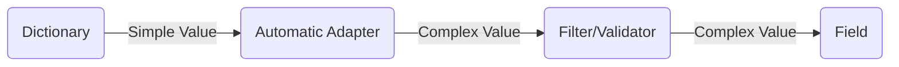
- Using `replace` strategy with non-void return type:
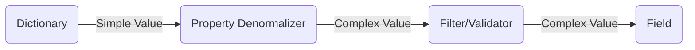
- Using `replace` strategy with void return type:
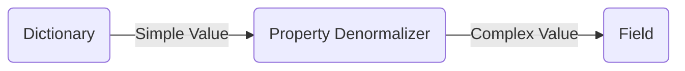
- Using `after` strategy with non-void return type:
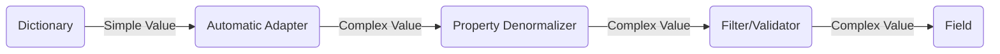
- Using `after` strategy with void return type:
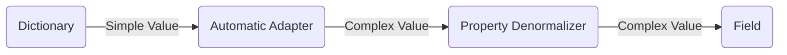

#### Syntax
```java
  public class ServiceCenter {
    public HealthReport[] reports;
    @Constant public Set<String> deadServices = Set.of();

    @Denormalizer(value = "reports", strategy = Denormalizer.Strategy.AFTER)
    private void filterReport(HealthReport[] reports) { // context parameter is optional
      reports = Arrays.stream(reports).filter(report -> report.service != null).toArray(HealthReport[]::new);
      deadServices = Arrays.stream(reports).filter(report -> report.status == 0).map(r -> r.service).collect(Collectors.toSet());
    }
  }

  public class HealthReport {
    public String service;
    public int ping;
    public int status;

    @Denormalizer(value = {"ping", "status"}) // default strategy is "replace"
    private int checkNegative(int n, Context ctx) {
      if (n < 0) throw new RuntimeException("Health report is malformed at "+ctx.getPath());
      return n;
    }
  }
```

### KeyInjector
- A key injector works on a Map. It takes the key and injects it to a property of the corresponding value
- Key injection happens once the object is instantiated and denormalized. Therefore, it overrides all previous values set.
- Key injection is in denormalization process

```java
@Configurable
public class Inventory {
  @KeyInjector("id")
  public Map<String, Item> items;
}

@Configurable
public class Item {
  @Exclude
  public String id;
  public String name;
  public int stock;
}
```

### Fallback
- The fallback takes all remaining K-V of the current wrapper and put them into the annotated K-V container or Map
- Properties fallback is in denormalization process
- For example:
```yaml
stack:
  name: Snack
  stock: 3
coca:
  name: Coca
  stock: 2
bread:
  name: Bread
  stock: 5
```
```java
@Configurable
public class Inventory {
  public Item bread; // bread

  @Fallback
  public Map<String, Item> items; // snack, coca
}
```

## Inline
Inline annotation allows to inject the fields of a specific type into the current type

```java
public class Level1WithoutInline {
  public int foo;
  public Level2 next;
} // including foo and next.test

public class Level1WithInline {
    public int foo;
    @Inline
    public Level2 next;
} // including foo and test

public class Level2 {
    public int bar;
}
```