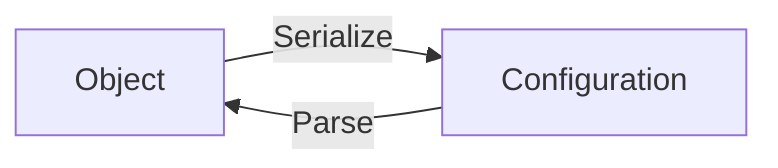
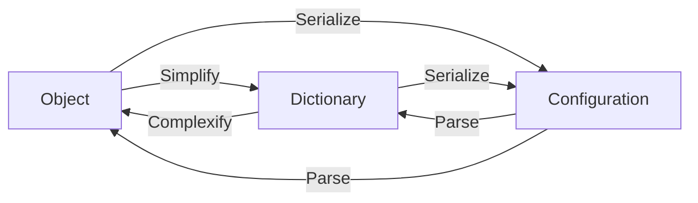
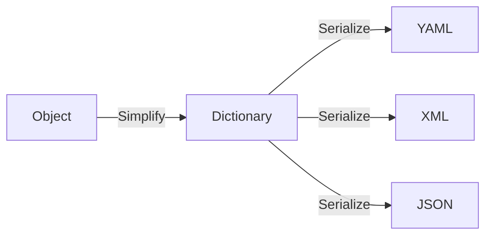

# Overview

## Schema
- A schema (or model) depicts the structure of a configuration
```java
public class Person {
  public String name;
  public int age;
  public Relationship relationship;
}
public class Relationship {
  public List<Person> friends;
}
```
- The schema may not represent the actual structure of a configuration
  + The section may require expanded structure
  ```yaml
  name: Alice
  age: 20
  relationship:
    friends:
      - name: Bob
        age: 21
      - name: Charlie
        age: 19
  ```
    + The section may require embedded structure
  ```yaml
  name: Alice
  age: 20
  friends:
    - name: Bob
      age: 21
    - name: Charlie
      age: 19
  ```
  + The section may require inlined structure
  ```yaml
  name: Alice
  age: 20
  friends: "Bob 21, Charlie 19"
  ```
  + The value may have different representation (text, number, etc)

## Conversion
- Conversion implies a one-to-one transformation
```
"10" <-> 10
"10.01" <-> 10.01f
```

## Mapping
- Mapping implies a one-to-many or many-to-one transformation
- The process of guessing the target type is called _type inference_
```
["1", "2"] -> HashSet, ArrayList, LinkedList, etc
```

## Serialization & parsing

- Serialization: the process of turning an object into a configuration by mapping it in respect of the representation (JSON/XML/YAML/etc)
  + Mapping
  + Conversion
- Parsing (or Deserialization): the process of turning a configuration into an object by mapping it in respect of the schema
  + Conversion
  + Mapping

## Schema modelling
- An object is modelled by a class. A class defines a _class schema_ in a _declarative_ manner
- The process of constructing a schema happens at:
  + Compile-time: using static code analysis
  + Runtime: using reflection

## Dictionary
- A dictionary represents a simple and dynamic container
  + Simple: it contains the most basic "building blocks" including string, number, boolean, array and sections
  + Dynamic: it is capable of holding as many data as needed
+ A dictionary represents an intermediary layer:
  + It may exist between object-side and configuration-side
+ A dictionary represents a bridge or an adapter:
  + It has the standard form of a configuration format
+ A dictionary can be _schemaless_
+ A dictionary can be modelled by a _dictionary schema_ in an _imperative_ manner
  + The dictionary schema may enforce strictness or loose

## Case study
### Gson
- In Gson, a type adapter is capable of serializing an object into JSON and parsing JSON into the object
- A factory type adapter generates different variant of type adapter e.g an array factory type adapter `T[]` creates different type adapters `T`
- A `Gson` instance caches type adapter lookup per thread (`ThreadLocal`)

## Gluing everything together
### Integrating with Gson
- Serialization:
  - Case 1: Map an object `T` into a dictionary `D` and use Gson to serialize the dictionary
  ```
  Total cost = [Map T -> D]     +       [Serialize D]
            (Map + conversion)    (Map + Conversion + Write)
  ```
  - Case 2: `D` has a specialized Gson type adapter
  ```
  Total cost = [Map T -> D]     +       [Serialize D]
            (Map + conversion)             (Write)
  ```
  - _^ What is the point of using Gson only to write the JSON?_
- Parsing:
  - Case 1: Use Gson to parse JSON into a dictionary `D` and map `D` into an object `T`
  ```
  Total cost =          [Parse D]       +      [Map D -> T]
               (Read + Conversion + Map)    (Conversion + Map)  
  ```
  - Case 2: `D` has a specialized Gson type adapter
  ```
  Total cost =          [Parse D]       +      [Map D -> T]
                        (Tokenize)          (Conversion + Map)  
  ```
  - _^ Again, what is the point of using Gson only to tokenize the JSON?_

### A parser and writer from scratch
- Having a built-in, standard parser and writer permits the most customizability and performance
- A type adapter, different from Gson's, should be a processor between a simple type (one that is allowed in a Dictionary) and a complex type
- A parser and writer, in the other hand, work directly between an object and a configuration


|                | Object       | Dictionary                   | Configuration     |
|----------------|--------------|------------------------------|-------------------|
| Data type      | Java object  | Java object                  | String            |
| Representation | Class        | Map                          | JSON/XML/YAML/etc |
| Schema         | Class schema | Schemaless/Dictionary schema | None              |
| Enforcement    | Strict       | Strict/Loose                 | None              |

## The intermediary layer is not useless
### Use case 1: Serialize into two or more configuration formats
- The intermediary layer already stores normalized and ready-to-use data. As such, the next step - writing configuration - is simple and straightforward


### Use case 2: Parse from two or more configuration formats
- The intermediary layer allows generic parsing by hiding away the actual configuration format

### Use case 3: Schemaless representation
- The intermediary layer enables flexible manipulation due to schemaless structure

### Use case 4: Runtime schema
- The intermediary layer may enforce strict or loose schema which is dynamically-generated at runtime

### Use case 5: Immutability and Singleton
- The intermediary layer introduces a simple approach to maintain immutability and singleton by resolving the following issues:
  - Deep copy is expensive because a data type is too complex
  - External data types may not provide `copy` or `duplicate` functionality
  - External data types may not be feasible to have multiple instances (violate singleton)
- The intermediary layer contains only simple types:
  - Primitive data type: they are intrinsically immutable
  - Array and Section: they can be wrapped in a cheap _immutable view_

## Streaming
- Some configuration format such as JSON is non-concatenative, as such, it is impossible to parse or serialize as stream because the syntax check is feasible only when the configuration is provided completely
- Some configuration format such as NDJSON/JSONL - which is a newline-delimited JSON - do support streaming

### Partial validation
- When parsing a configuration as a stream, we may introduce a fast-scanning mode which skips partial syntax validation. This is a good optimization technique in certain cases when the configuration is already validated beforehand.

### Appendable segments
- For a concatenative variant of configuration format such as NDJSON/JSONL, we interpret the configuration in two different approaches:
  - Separate segments: Each format defines their own segment delimiter. For e.g. NDJSON/JSONL defines `\n` (newline). The delimiter is used to separate independent segments. Each segment represents a distinct object.
  ```json lines
    {"hello": true} // -> {"hello": true}
    {"world": true} // -> {"world": true}
  ```
  - Appendable segments: Another approach is let these segments belong to a single object. As such, each segment represents a chunk of the object.
  ```json lines
    {"hello": true} // -> {"hello": true}
    {"world": true} // -> {"hello": true, "world": true}
    {"hello": false} // -> {"hello": false, "world": true}
  ```

### Pipeline
- Two strategies above are well fit into parsing configuration. However, it is hard to produce an approach for streaming serialization because the process requires a complete object.
- Pipeline technique allows parse - manipulate - serialize a complex configuration
```
  INPUT                BUFFER                OUTPUT
       \___[parse] [manipulate] [serialize]___/     
      
       /========================================\
```